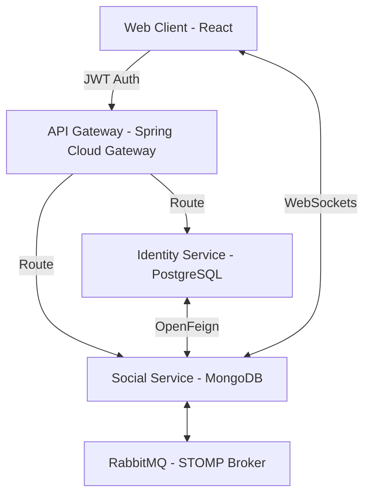

# 🚀 Kirenz-Platform: Microservices Social Media Demo

> A comprehensive full-stack social media platform reimagined as a modern microservices architecture. Designed as a learning project to demonstrate distributed systems, real-time communication, and polyglot persistence.

---

## 🎯 Project Overview

Kirenz-Platform is a scalable social networking system that mimicks real-world platforms. It transitions from a monolithic structure to a distributed architecture, leveraging Java 21, Spring Boot 3, and modern infrastructure.

### Core Architecture
The system is divided into specialized microservices:
- **Identity Service**: Owner of User identity, authentication (JWT), profiles, social graphs (friends), and privacy/blocking data.
- **Social Service**: Manager of all content (posts, comments, shares, search, reporting), real-time chat (1-1 & groups), media assets, and notifications.
- **API Gateway**: Secure entry point for request routing and edge security validation.

---

## ✨ Features

### 👤 Identity & Relationships (Identity Service)
- **Secured Authentication**: JWT-based stateless login/register.
- **Rich Profiles**: Customizable user data with activity stats and visibility settings.
- **Friendship Lifecycle**: Request, accept, and manage connections; close friends support.
- **Privacy Controls**: Granular settings for profile visibility and user blocking.

### 📝 Social Discovery (Social Service)
- **Content Sharing & Management**: Create, edit, delete, and share posts with original source tracking.
- **Emoji Reactions & Comments**: Engage through reactions and nested discussion threads.
- **Global Search**: Search across users, posts, and hashtags.
- **Reporting System**: User-driven reporting for posts, comments, and profiles.
- **Media Optimization**: Integrated media management with Cloudinary for images and video.

### 💬 Real-time Communication (Social Service)
- **1-on-1 & Advanced Group Chats**: Real-time messaging with role-based group administration (Owner, Admin, Member).
- **Presence & Delivery Status**: Live online status, typing indicators, and message status tracking.
- **Multi-modal Messages**: Seamless sharing of text and media within chat.

### 🛡️ Administration & Analytics (Admin Role)
- **Advanced Dashboard**: Real-time health metrics and concurrent traffic monitoring.
- **User Analytics**: Deep insights into DAU, registrations, and engagement levels.
- **Moderation Hub**: Centralized processing of user reports and content governance.

---

## 🏗️ Technical Architecture

### Stack Components
- **Framework**: Java 21+ & Spring Boot 3.x
- **Persistence**: 
  - **Relational**: PostgreSQL (Identity, Relationships, Privacy)
  - **NoSQL**: MongoDB (Messages, Posts, Reports, Notifications)
- **Messaging**:
  - **Synchronous**: Spring Cloud OpenFeign
  - **Asynchronous**: RabbitMQ (Real-time Messaging & Event Sync)
- **Security**: Spring Security & JWT
- **Resilience**: Resilience4j (Circuit Breaker)
- **Documentation**: OpenAPI 3 / Swagger

---

## 📂 Project Structure

- `identity-service/`: User identity, relationships, and auth.
- `social-service/`: Content engine, real-time communication, and notifications.
- `api-gateway/`: Security and routing layer.
- `docs/`: 
  - [Use Cases](./docs/use-cases.md) - Refined functional requirements and service ownership.
  - [Architecture Specs](.kiro/specs/architecture-clarification/requirements.md) - Technical constraints.

---
*Developed for learning purposes to explore high-scale system design.*